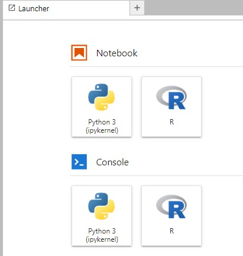

# Intall R kernel for jupyter notebook (Windows Edition)

## Get R

You can get R for windows from https://cran.r-project.org/bin/windows/base.

## R Kernel: Method 1

1. Install miniconda from https://docs.conda.io/en/latest/miniconda.html.
    - Select the appropriate version 

2. Create a new virtual environment for R

```sh
> conda create -n recsys-env -y
# you can use whatever name you want instead of 'recsys-env' 
```

3. Find the location of your R installation. It may be found in `C:\Program Files\R\R-4.2.1\bin`.

    Note that my version of R is `R-4.2.1`; Yours may be different.

    When You find it, double-click to open  it and the run the following commands:

    - install.packages("devtools")
    - devtools::install_github("IRkernel/IRkernel")
    - IRkernel::installspec()

    This Step may take some time to complete.

4. Install Jupyter lab

```sh
> conda install jupyterlab -y 
```

5. You are done !
In your virtual environment, run `jupyter lab` and enjoy your R Kernel installation.

<div>
    <center>
    
    </center>
</div>

If you cannot open R notebooks, then stop the current jupyter server (Ctrl+C) and install R Kernel from anaconda prompt like this:

```sh
> conda install -c r r-irkernel -y
```

## R Kernel: Method 2

I have attached the config file of my own virtual environment that you can download. Everything can be installed and replicated without any issue just like this:

```sh
> conda env create -f <path_to_recsys_env.yml>
# e.g. conda env create -f ../../recsys_env.yml
```
